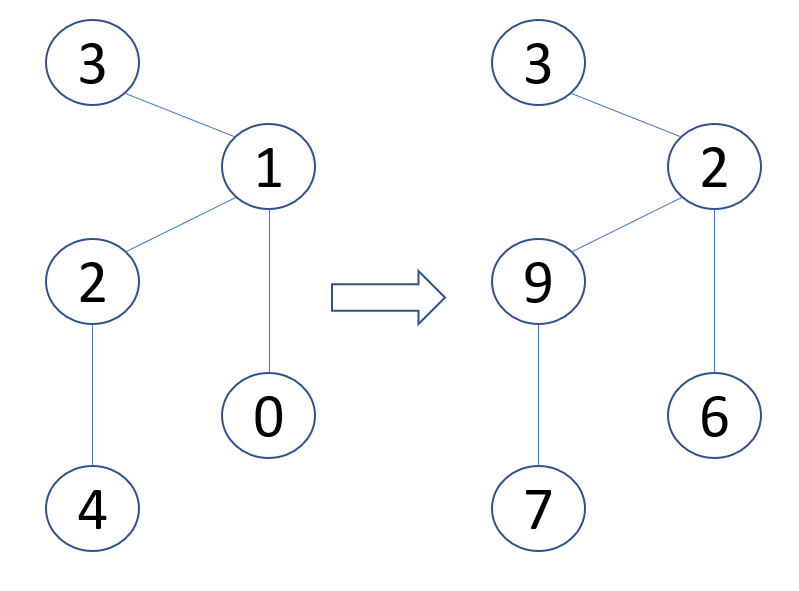

# Stations (stations)

Singapore's Internet Backbone (SIB) consists of $n$ stations, which are assigned **indices** from $0$ to $n-1$. There are also $n-1$ bidirectional links, numbered from $0$ to $n-2$. Each link connects two distinct stations. Two stations connected with a single link are called neighbours.

A path from station $x$ to station $y$ is a sequence of distinct stations $a\_0,a\_1,\cdots,a\_p$, such that $a\_0=x$, $a\_p=y$, and every two consecutive stations in the path are neighbours. There is **exactly one** path from any station $x$ to any other station $y$.

Any station $x$ can create a packet (a piece of data) and send it to any other station $y$, which is called the packet's **target**. This packet must be routed along the unique path from $x$ to $y$ as follows.
Consider a station $z$ that currently holds a packet, whose target station is $y$ ($z \neq y$).
In this situation station $z$:
1. executes a **routing procedure** that determines the neighbour of $z$ which is on the unique path from $z$ to $y$, and
2. forwards the packet to this neighbour.

However, stations have limited memory and do not store the entire list of the links in SIB to use it in the routing procedure.

Your task is to implement a routing scheme for SIB, which consists of two procedures.
* The first procedure is given $n$, the list of the links in the SIB and an integer $k \geq n-1$ as the inputs. It assigns each station a **unique** integer **label** between $0$ and $k$, inclusive. 
* The second procedure is the routing procedure, which is deployed to all stations after labels are assigned. It is given **only** the following inputs:
  - $s$, the **label** of the station that currently holds a packet,
  - $t$, the **label** of the packet's target station ($t \neq s$),
  - $c$, the list of the **labels** of all neighbours of $s$.

  It should return the **label** of the neighbour of $s$ that the packet should be forwarded to.

In one subtask, the score of your solution depends on the value of the maximum label assigned to any station (in general, smaller is better).

## Implementation details

You should implement the following procedures:

```
int[] label(int n, int k, int[] u, int[] v)
```

* $n$: number of stations in the SIB.
* $k$: maximum label that can be used.
* $u$ and $v$: arrays of size $n-1$ describing the links. For each $i$ ($0 \leq i \leq n-2$), link $i$ connects stations with indices $u[i]$ and $v[i]$.
* This procedure should return a single array $L$ of size $n$. For each $i$ ($0 \leq i \leq n-1$) $L[i]$ is the label assigned to station with index $i$. All elements of array $L$ must be unique and between $0$ and $k$, inclusive.

```
int find_next_station(int s, int t, int[] c)
```

* $s$: label of the station holding a packet.
* $t$: label of the packet's target station.
* $c$: an array giving the list of the labels of all neighbours of $s$. The array $c$ is sorted in ascending order.
* This procedure should return the label of a neighbour of $s$ that the packet should be forwarded to.

Each test case involves one or more independent scenarios (i.e., different SIB descriptions).
For a test case involving $r$ scenarios, a **program** that calls the above procedures is run exactly two times, as follows.

During the first run of the program:

* `label` procedure is called $r$ times,
*  the returned labels are stored by the grading system, and
* `find_next_station` is not called.

During the second run of the program:

* `find_next_station` may be called multiple times. In each call, an **arbitrary** scenario is chosen, and the labels returned by the call to `label` procedure in that scenario are used as the inputs to `find_next_station`.
* `label` is not called.

In particular, any information saved to static or global variables in the first run of the program is not available within `find_next_station` procedure.

## Example

Consider the following call:

```
label(5, 10, [0, 1, 1, 2], [1, 2, 3, 4])
```

There are a total of $5$ stations, and $4$ links connecting pairs of stations with indices $(0, 1)$, $(1, 2)$, $(1, 3)$ and $(2, 4)$. Each label can be an integer from $0$ to $k=10$.

In order to report the following labelling:

| Index | Label |
|-------|-------|
| 0 | 6 |
| 1 | 2 |
| 2 | 9 |
| 3 | 3 |
| 4 | 7 |

the `label` procedure should return [$6$, $2$, $9$, $3$, $7$]. The numbers in the following figure show the indices (left panel) and assigned labels (right panel). 



Assume the labels have been assigned as described above and consider the following call:

```
find_next_station(9, 6, [2, 7])
```

This means that the station holding the packet has label $9$, and the target station has label $6$. The labels of stations on the path to the target station are $[9, 2, 6]$.
Hence, the call should return $2$, which is the label of the station that the packet should be forwarded to (which has index $1$).

Consider another possible call:

```
find_next_station(2, 3, [3, 6, 9])
```

The procedure should return $3$, since the target station with label $3$ is a neighbour of the station with label $2$, and hence should receive the packet directly.

## Constraints
* $1 \leq r \leq 10$

For each call to `label`:
* $2 \leq n \leq 1000$
* $k \geq n-1$
* $0 \leq u[i], v[i] \leq n - 1$ (for all $0 \leq i \leq n - 2$)

For each call to `find_next_station`, the input comes from an arbitrarily chosen previous call to `label`. 
Consider the labels it produced.
Then:
* $s$ and $t$ are labels of two different stations.
* $c$ is the sequence of all labels of neighbours of the station with label $s$, in ascending order.

For each test case, the total length of all arrays $c$ passed to the procedure `find_next_station` does not exceed $100\;000$ for all scenarios combined.

## Subtasks

1. (5 points) $k = 1000$, no station has more than $2$ neighbours.
2. (8 points) $k  = 1000$, link $i$ connects stations $i+1$ and $\left\lfloor \frac{i}{2} \right\rfloor$.
3. (16 points) $k = 1\;000\;000$, at most one station has more than $2$ neighbours.
4. (10 points) $n \leq 8$, $k = 10^9$
5. (61 points) $k = 10^9$

In subtask 5 you can obtain a partial score.
Let $m$ be the maximum label value returned by `label` across all scenarios. Your score for this subtask is calculated according to the following table:

| Maximum label | Score|
|:----:|:---:|:---:|
| $m\geq10^9$ | $0$ |
| $2000 \leq m < 10^9$ | $50 \cdot \log_{5\cdot10^5}(\frac{10^9}{m})$  |
| $1000 < m < 2000$ | $50$|
| $m\leq 1000$ | $61$ |

## Sample grader

The sample grader reads the input in the following format:
* line $1$: $\;\;r$

$r$ blocks follow, each describing a single scenario. The format of each block is as follows:

* line $1$: $\;\;n\;\;k$
* line $2+i$ ($0 \leq i \leq n - 2$): $\;\;u[i]\;\;v[i]$
* line $1 + n$: $\;\;q$: the number of calls to `find_next_station`.
* line $2 + n + j$ ($0 \leq j \leq q - 1$): $\;\;z[j]\;\;y[j]\;\;w[j]$: **indices** of stations involved in the $j$-th call to `find_next_station`. The station $z[j]$ holds the packet, the station $y[j]$ is the packet's target, and the station $w[j]$ is the station that the packet should be forwarded to.

The sample grader prints the result in the following format:
* line $1$: $\;\;m$

$r$ blocks corresponding to the consecutive scenarios in the input follow. The format of each block is as follows:
* line $1 + j$ ($0 \leq j \leq q - 1$): **index** of the station, whose **label** was returned by the $j$-th call to `find_next_station` in this scenario.

Note that each run of the sample grader calls both `label` and `find_next_station`.
